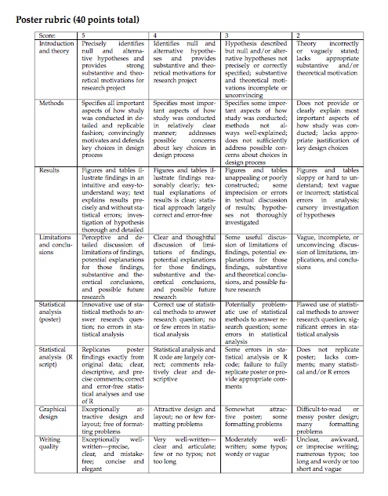

# Final Poster Project Guide

```{r}
knitr::opts_chunk$set(echo = TRUE)
```

## Learning Objectives

By the end of this guide, you will understand how to design and execute a complete research project, including developing a falsifiable hypothesis, collecting or finding appropriate data, conducting statistical analysis, and presenting your findings in a professional poster format. You'll also learn what I'm looking for when grading these projects and how to avoid the most common mistakes students make.

## What Is This For?

The poster project is one of the most important part of this course, worth 20% of your final grade. This is your opportunity to take everything you've learned about research design, data analysis, statistical reasoning, data management, and visualization and apply it to a question you genuinely care about. Unlike problem sets where I give you the data and tell you what to analyze, here you'll make all the decisions: What question should I ask? How should I collect data? What statistical methods are appropriate? How should I present my findings?

I grade these posters personally because I consider them the culmination of your learning this semester. The best projects don't just demonstrate technical competence—they show genuine curiosity about the world and a willingness to take intellectual risks. I greatly prefer teams who pursue exciting, ambitious questions and find null results to teams that play it safe with uninteresting hypotheses. Science works by being wrong productively, and you're new at this, so embrace the possibility that your hypothesis might not be supported.

That said, null results are only acceptable when your research design is sound, your analysis is correct, and you interpret those results thoughtfully. This guide will help you understand what constitutes good research design and how to present your work professionally, regardless of whether your hypothesis is supported.

## Project Deliverables and Timeline

You'll submit your project as a single ZIP file containing three components: a PDF of your poster, an R script with all your analysis code, and all the data files needed to run that code. The submission is due by 5pm on the date listed on the syllabus. During your final lab session, I will attend and hear your  poster presentation. You'll explain your project, present your results, and answer questions from me and other students.

Your R script must be completely replicable. The only thing I should need to change is the working directory. Otherwise, when I run your code, it should execute without any errors and produce results that exactly match what's on your poster. Any discrepancies or errors will result in point deductions. Your code should also include informative comments throughout (using the # symbol) explaining what you're doing. Code without comments will be penalized. Generally, I don't need to see all the code you used to collect, organize, or clean your data—but I do want the code that takes your final dataset, conducts the statistical analyses, and generates the tables and figures that appear on your poster.

To get you started, I will ask each group to provide me with a one page description of your project by November 1.  The format of this document is quite flexible, and is not a firm commitment. But it is an opportunity to work with your group to put a plan down on paper (even if you may deviate later).  The document shouldch outline the goals of the project, a sketch of your approach, individual responsibilities of the project members, and a tentative schedule. I recommended you
include milestones and deliverables in your project plan, which helps to keep your group accountable.

## Finding Your Research Question

The most important decision you'll make is choosing your research question. You should have a strong and substantive motivation for why you chose it. This means more than just "I thought it would be interesting"—you need to explain why this question matters, what gap in our understanding it addresses, or what practical or theoretical implications the answer might have. Your motivation section should include a few sentences of background context.

More fundamentally, though, you need to care about the question itself. What topics interest you? What phenomenon are you dying to explain? If you don't care about the question, this project will be miserable to complete. I've seen teams produce brilliant work on topics as diverse as recycling behavior, mental health services on campus, election fraud, and partisan polarization—what they all had in common was genuine intellectual curiosity.

Your research question should be succinct and easily understood. Most importantly, it needs to be falsifiable. This is not the same as being "provable"—it means you need to be able to tell me what kind of statistical evidence would prove you wrong. If you can't explain that, you don't really have a scientific theory (or a null hypothesis for that matter). For example, "What makes college kids vote?" is too vague to be falsifiable. But "College students in states with stricter voter ID laws vote at rates 5-10 percentage points lower than students in states without such laws" is falsifiable—you could test this and potentially reject it.

Your question also needs to be specific enough to be manageable but interesting enough to matter. Broad questions like "Why do Americans vote?" or "What causes peace?" are too big. You need something you can actually test with available data and time. Better questions might be "Do college students vote more when registration is easier?" or "Does information about campus mental health wait times affect support for new campus construction?" These are specific, testable, and potentially interesting.

## Theory and Hypotheses

Once you have a question, you need to develop a theory. This doesn't have to be elaborate, but you need to clearly state what you expected when you started gathering data and why. What's your theory of how the world works? For example, if you're studying whether "please recycle" signs increase recycling behavior, your theory might be that visible prompts activate social norms and reduce cognitive load, making pro-environmental behavior more likely. This gives your hypothesis a foundation beyond simple speculation.

Your hypothesis needs to be precisely stated with both null and alternative versions. The null hypothesis typically states there is no relationship or effect. The alternative hypothesis states what you expect to find. Be specific about the direction and magnitude when possible. "Recycling signs increase recycling" is vague. "Recycling bins with visible signs will have more recyclable materials than bins without signs" is better—it's specific, measurable, and falsifiable.

## What You Cannot Do

While you have considerable freedom in choosing your topic, there are some important boundaries. First, you cannot conduct time-series studies where you're studying one unit over time. Questions like "What drives presidential approval over time?" are out of bounds because time-series analysis requires additional statistical skills not covered in this course. 

Second, you cannot do purely exploratory projects. If you ask "What factors determine attitudes toward abortion?" without specifying which factors and why, that's exploration, not hypothesis testing. You need to tell me what factors you think drive attitudes toward abortion, explain your reasoning, and then test that theory.

Third, you cannot collect sensitive data, study risky behaviors, or work with at-risk populations. This means no surveys about dating habits, drug use, or alcohol consumption. No surveys of minors or homeless populations. These restrictions exist both for ethical reasons and because proper study of these topics requires IRB approval and methodological training you haven't yet received.

Fourth, you cannot sample on the dependent variable. This is a crucial methodological point that many students miss. If you want to study the causes of election fraud, you cannot only look at cases where fraud occurred—you also need cases where fraud did not occur for comparison. Similarly, if you want to study causes of police shootings, you can't only examine shooting incidents—you need cases where police encounters did not result in shootings. Without variation in your dependent variable, you cannot identify what causes that variation.

Finally, you cannot sample on the independent variable. If you want to study the effect of church attendance on political beliefs, you can't only survey people at church. To identify the effect of church attendance, you need to compare church-goers to non-church-goers. This seems obvious when stated plainly, but students often overlook this when designing surveys.

## What You Should Do

While there are restrictions, there are also exciting possibilities. You're encouraged (though not required) to conduct your own experiment. Do "please recycle" signs cause people to recycle more? Does information about wait times affect perceptions of campus services? Do different question wordings produce different survey responses? Experiments let you establish causal relationships in ways that observational data cannot. If you plan to collect your own data, please see me before executing your plan—I may be able to provide incentives like drawings for gift cards.

The university pays for all students to have access to Qualtrics, a powerful survey software. If you want to survey Washington University students about topics they care about—campus politics, student life, attitudes toward university policies—this can produce engaging and relevant research. Just remember to follow all the sampling rules discussed above.


If you don't plan to collect your own data, many excellent datasets are freely available. [Harvard's Institute for Quantitative Social Sciences](https://dataverse.harvard.edu/) maintains Dataverse, a massive repository of social science data. The [American National Election Study](http://www.electionstudies.org/) provides rich data on American political behavior and attitudes. The [ICPSR Data Archives](https://www.icpsr.umich.edu/icpsrweb/instructors/icsc/datasets.jsp) at the University of Michigan offer thousands of datasets on topics ranging from crime to health to education. The [Washington University library](https://library.wustl.edu/research-support/data-services/) also provides data services and can help you locate data on your topic.

And of course, if only you knew a faculty member with wide-ranging interests in quantitative analysis who is experienced in helping undergraduates get the data they need to do good projects—perhaps you could ask her or him for help.

## Understanding the Grading Rubric

Your project is graded on eight components, each worth five points, for a total of 40 points. Let me walk you through each section and explain what distinguishes excellent work from mediocre work.

```{r rubric_image}
library(knitr)

```

### Introduction and Theory

An excellent introduction precisely identifies both null and alternative hypotheses and provides substantive and theoretical motivation for the research project. This means more than saying "I wanted to know about X"—it means explaining why X matters theoretically or practically, what gap in knowledge your project addresses, and what theory predicts about the relationship you're studying.

A merely good introduction identifies the hypotheses and provides motivation, but perhaps less precisely or thoroughly. A mediocre introduction describes hypotheses without precisely specifying them or lacks clear substantive motivation. A weak introduction states theory incorrectly or vaguely and lacks appropriate theoretical grounding.

### Methods

An excellent methods section specifies all important aspects of how the study was conducted in detailed and replicable fashion. This means explaining both where your data came from and how you tested your hypothesis. If you collected data yourself, describe your survey questions, sampling approach, and any important methodological choices. If you used pre-existing data, explain the source and briefly describe its methodology. This applies to covariates as well—if you're controlling for income or education, explain where those variables came from.

Crucially, you must justify your analytical choices. Why did you use regression instead of a t-test? Why did you include certain control variables? Why did you transform variables in particular ways? Note that the example posters provided are from a more advanced version of this class, so you won't be familiar with all the models they use. You are not expected to use advanced models to get full credit—but whatever modeling choices you make, you must defend them.

A merely good methods section covers most important aspects relatively clearly and addresses possible design choices. A mediocre section specifies some important aspects but doesn't always explain methods well or misses key design choices. A weak section fails to provide most important information about study conduct or methodology.

### Results

Remember: This is a poster, not a paper. An excellent results section uses figures and tables to illustrate findings in an informative and easy-to-understand way. The graphics tell a clear story with minimal text needed. All figures must be created in R—Excel figures make me angry. Tables may be created in Microsoft Office (or other tools), although we will show you how to make attractive tables for your poster later in the class. Your figures should be thorough, detailed, and properly labeled with clear axes and legends.

You should let your graphics do most of the work. Don't write long paragraphs explaining every detail—use short comments that direct attention to key findings. Look at the example posters to see how successful teams present results visually.

A merely good results section has clear figures and tables with reasonably clear explanations. A mediocre section has unappealing or poorly prepared visualizations that aren't fully integrated with text discussion. A weak section has sloppy or hard-to-understand graphics with weak integration of hypotheses.

### Limitations and Conclusions

An excellent limitations and conclusions section provides thorough discussion of the limitations of your findings, potential design flaws, and interpretation of results. Every research project has limitations—sample size, measurement issues, confounding variables you couldn't control, generalizability concerns. Acknowledge these forthrightly and thoughtfully. Don't just provide "pro forma" limitations (the kind where you say "well, we could have had a bigger sample" without really thinking about implications). Think seriously about what could affect your results and why.

Your conclusion should discuss potential explanations for your findings. Were results statistically significant? What does this tell you about your research question? What inferences can we draw? What are ideas for future research? You must state whether you rejected your null hypothesis. And remember: it is not required that you find statistically significant results. Most teams won't. This is okay if your research design was sound and you interpret null results thoughtfully.

A merely good section has clear and thoughtful discussion with substantive conclusions but perhaps less depth. A mediocre section provides some useful discussion but with incomplete or less sound conclusions. A weak section is vague, incomplete, or inconsistent.

### Statistical Analysis (Poster)

An excellent statistical analysis uses innovative or at minimum correct statistical methods appropriate for your research question with no errors. A merely good analysis uses correct methods with no or few errors. A mediocre analysis potentially uses inappropriate methods with some errors. A weak analysis has flawed methods with significant errors.

Note that this is a grade for the choices themselves, not the writing. The score here is about whether or not you used the appropriate methdos for your question.  The "methods" score is about whether they are clearly described and justified.

### Statistical Analysis (R Script)

An excellent R script replicates poster findings exactly from correctly annotated code with clear comments explaining your analytical choices. A merely good script largely replicates analysis with mostly clear code. A mediocre script provides partial replication or has faulty code with incomplete comments. A weak script doesn't replicate results, lacks comments, or has significant errors.

This is critical: I must be able to run your script (changing only the working directory) and get your exact poster results. Any discrepancies equal point deductions.

### Graphical Design

An excellent poster is exceptionally and appropriately laid out with no formatting problems. The layout flows easily and is aesthetically pleasing. It's not unreasonably colored and doesn't have weird fonts, formatting issues, text that leaks across columns, etc.  

Most groups use Microsoft PowerPoint, but other tools are fine. Whatever you use, make it clean and readable. A merely good poster has attractive design with few formatting problems. A mediocre poster is somewhat attractive but has some formatting issues. A weak poster is difficult to read or poorly designed with many formatting problems.

### Writing Quality


The single most common way students lose points is by making posters that are too wordy.You should be able to succinctly explain each step of your research without writing a page on it. In fact, I'd be happy with no paragraphs. Use full sentences, but don't cram paragraph after paragraph of text.


An excellent poster is exceptionally well-written and articulate with precise, clear, mistake-free prose. It's concise and elegant, not too long. A merely good poster is very well-written with few or no typos and appropriate length. A mediocre poster is moderately well-written but has some typos and is wordy or vague. A weak poster is unclear and awkward with numerous typos and length problems.

## Learning from Example Posters

Below are posters that did very well in past years. However, none were perfect. I'll point out strengths and weaknesses so you can do even better. PDF versions of all example posters are available on Canvas in the 'ExamplePosters' directory.  Higher resolution versions of all of these posters are provided on Canvas.


### Example 1: Hating Habif

This poster examined how information about wait times affects student perceptions of campus mental health services.

```{r example1}
include_graphics("Images/Habifposter.png")
```

**Strengths:** Strong motivations for research and hypothesis about something the team genuinely cared about. They ran their own experiment and created visually attractive, clearly presented results.

**Weaknesses:** The sample size could have been bigger. The conclusion section was a bit wordy. The limitations were somewhat pro forma rather than deeply engaged with potential problems.


### Example 2: Should I Switch Where I'm Registered?

This poster examined whether students are more likely to switch their registration to states with more competitive elections

```{r example2}
include_graphics("Images/poster1.png")
```


**Strengths:** This team had strong motivations for their research and developed a clear hypothesis about something they genuinely cared about. They ran their own survey and analyzed two different datasets! Their limitations and conclusion sections were exhaustive with substantive interpretation of results. This showed real intellectual engagement with their findings.

**Weaknesses:** Despite these strengths, this project was way too wordy. The design included too many text descriptions when it should have relied more on graphs and tables to speak for themselves. While the results were well done, the organization and structure made it hard to follow. The poster would also have been stronger with explicit prospects for future research.

### Example 3: Voter Registration

This poster explored whether changes in early-voting laws in specific North Carolina counties affected voter turnout. 

```{r example3}
include_graphics("Images/poster3.png")
```

### Example 4: Money Trouble

This poster explores how student attitudes about adding more buildings to campus changes when students learn about budget difficulties in other campus operations. 
```{r example4}
include_graphics("Images/poster2.png")
```

**Strengths:** This poster provided substantive reasons for research with a clear hypothesis. The methods section described both data collection techniques and hypothesis testing techniques—this is what you should aim for. Their limitations and conclusions sections were substantive and perceptive. Most importantly, their results section allowed graphics to speak for themselves, making it easy to understand findings without paragraphs of information.

**Weaknesses:** The poster should have included more specific grounds for future research beyond general suggestions. There were some small spelling and grammatical errors. And yes, it was still somewhat wordy in parts.

## Tips for Success

### Start Early

This advice applies to all group projects, but it's especially important here. Groups that start after Thanksgiving Break don't do as well as groups that begin closer to the beginning of November. This project is worth 20% of your grade—don't take it lightly. Starting early gives you time to work out problems, get feedback, revise your approach, and produce polished work.

### Come to Office Hours Early and Often

While you're note required to come speak with me once about your project, I strongly encourage multiple check-ins. I grade these projects, so only I know what I'm looking for. Teams that meet with me early and often consistently do well. The only teams that have received objectively bad grades made drastic changes to their research project at the last minute without consulting me. Don't be that team.

The TAs are excellent resources for specific questions and help with R, but I should be your first and last point of contact for big questions about topic selection, research design, theoretical development, and interpretation. Don't hesitate to reach out.

### Pay Close Attention to the Rubric

Take a close look at the markers for getting high marks in each grading section. I will follow these requirements for fives very closely. Use the rubric as a checklist before submitting. Have you addressed every component? Have you met every requirement for a five in each section? The rubric isn't arbitrary—it represents what I genuinely believe constitutes excellent research at your level.

## Technical Requirements

### Creating Your Poster

Most students use Microsoft PowerPoint to create posters, though you're welcome to use other tools like Adobe Illustrator, LaTeX beamerposter, or Inkscape. Whatever tool you choose, your poster should be readable from 3-4 feet away. Use large fonts: at least 72 points for the title, 48 points for headers, and 28-32 points for body text. Standard poster size is around 36 inches by 48 inches.

You must export your poster to PDF before submission. In PowerPoint, go to File, then Save As, choose PDF from the file type dropdown, and select "High Quality" or "Best for Printing" in options.

### Printing Your Poster

You don't need to print your poster.  This class is just to big to organize a real poster session!  But if you really want an amazing docration for your dorm/appartment, there are multilpe places on campus where you can print your poster.

### R Code Best Practices

Your R script should be organized and well-commented. Start with a header identifying your team and members. Load all necessary libraries at the beginning. Set your working directory early—this should be the only line I need to change. Organize your code into clear sections: data loading, data preparation, descriptive statistics, hypothesis testing, and figure generation.

Comment extensively. Explain what each section does, why you made certain choices, and what results mean. Don't just describe what the code does line by line—explain your reasoning. For example, rather than commenting "creates a new variable," write "creates binary variable for high education (BA or higher) to test hypothesis that education increases voting."

Before submitting, close R completely, open only your submitted script, change only the working directory, run the entire script, and verify all results match your poster. This is what I will do, so test it yourself first.

## Frequently Asked Questions

**What if my results aren't statistically significant?** This is completely fine and very common in real research. You will not be penalized for null results. What matters is that your research design was sound, your analysis was correct, you interpreted null results properly, you discussed why you might have gotten null results, and you suggested future research directions. Remember: I prefer ambitious projects with null results to safe projects with weak findings.

**Can I use Excel for figures?** No. Excel figures make me angry. All figures must be created in R. However, tables may be created using Microsoft Office tools.

**How long should each section be?** Shorter is better. This is a poster, not a paper. The most common issue is being too wordy. As a rough guide: introduction should be 2-3 short paragraphs, methods should be one to three short paragraphs, results should let figures do the talking with two to three sentences per figure, conclusion should be one paragraph, and limitations can be bullet points or one paragraph. When in doubt, cut text and add visual elements.

**What if I can't find the right data?** Come talk to me. I have extensive experience helping students find data. Options include using different data for a similar question, collecting your own data through surveys or experiments, modifying your question to fit available data, or asking a faculty member who knows about quantitative data. (Hint: that faculty member is me.)

**Can I change my topic mid-project?** You can, but be careful. The only teams that have gotten objectively bad grades made drastic changes at the last minute without consulting me. If you need to change topics, come talk to me immediately, explain why, get approval for your new topic, and understand that you must still meet all deadlines.

**Can I work alone?** This is designed as a group project, but if you have special circumstances, come discuss them with me.

## Final Reminders

Start early. Come to office hours multiple times. Be concise—fewer words is better. Null results are okay—I prefer ambitious failures to safe projects. Study the rubric—I follow it closely. Test your R code—it must run perfectly. And ask for help—I want you to succeed.

This project is challenging but rewarding. Follow these guidelines, start early, come to office hours, and you'll create something you're proud of. Good luck!

