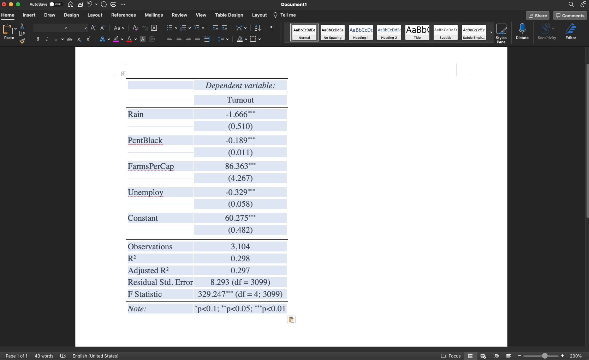
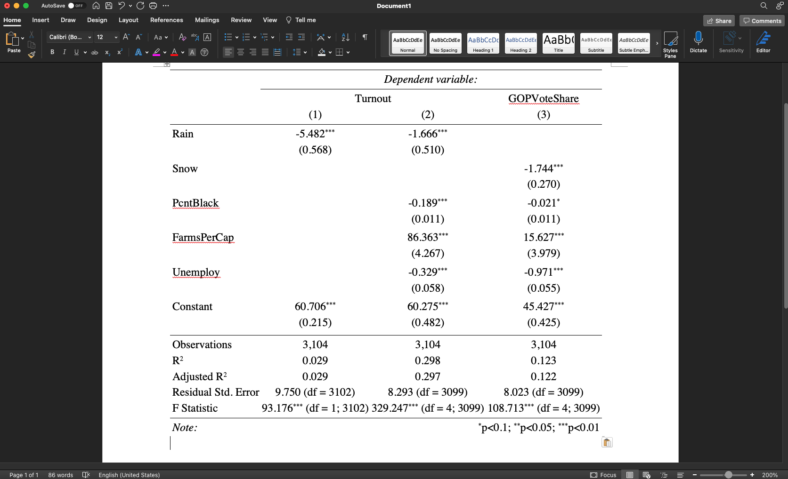
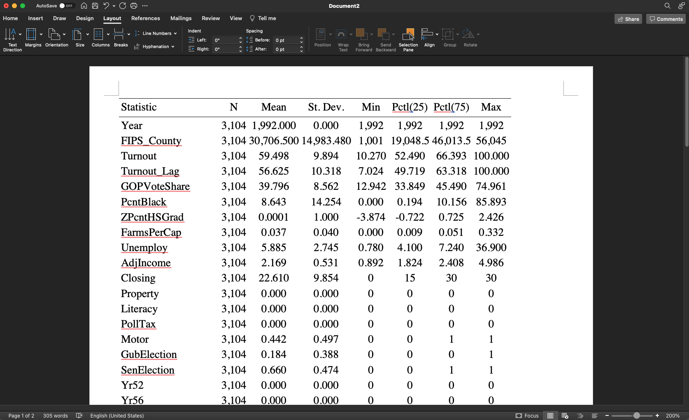
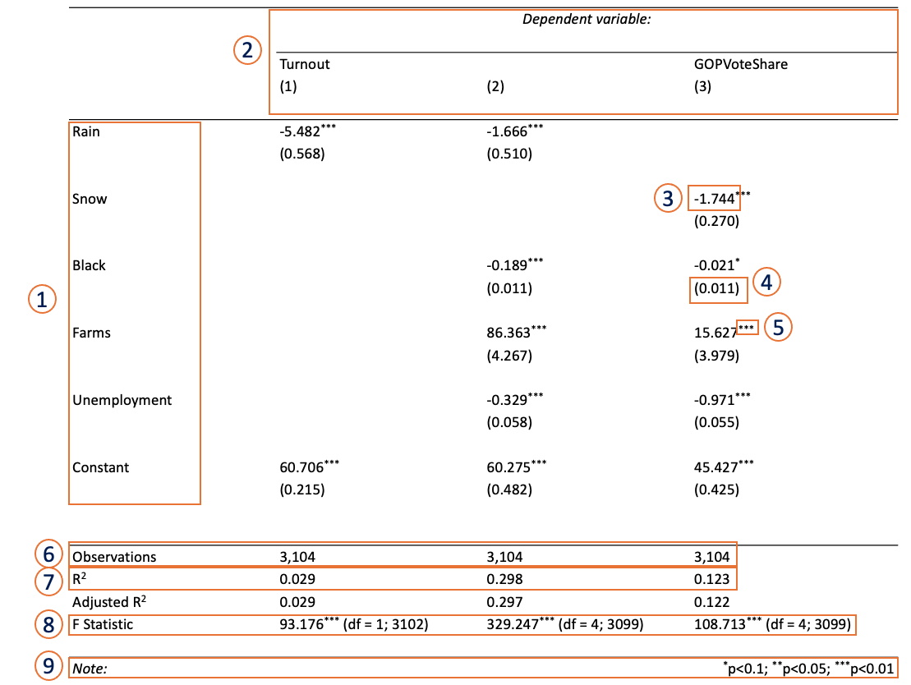

```{r setup, include=FALSE}
knitr::opts_chunk$set(echo = TRUE, message = FALSE, warning = FALSE)
```

## Learning Objectives

1. Learn how to create and export regression tables from `R`.
2. Learn how to read regression tables.
3. Learn how to report regression results factually.


## Creating and Exporting Regression Tables from `R`

In this lab, you'll learn how to create and export regression tables using the `stargazer` package. Let's use the `Weather_pol.csv` dataset that is adapted from [Gomez et al. (2007)](https://www.journals.uchicago.edu/doi/full/10.1111/j.1468-2508.2007.00565.x) as an example. Here, we want to analyze whether `Rain` (in inches) affected the level of `Turnout` in US counties during the presidential election in 1992. 

First, let's start with a multiple regression model where `Rain` is the primary explanatory variable, while `PcntBlack`, `FarmsPerCap`, as well as `Unemploy` are the control variables.

```{r, message = FALSE, warning=FALSE}
library("dplyr")
weather <- read.csv("../Data/Weather_pol.csv")
weather1992 <- weather %>%
  filter(Year == 1992) %>%
  select(Turnout, GOPVoteShare, County, Rain, PcntBlack, FarmsPerCap, 
    Unemploy, Snow, Year)

print(head(weather1992))

# Run and store the regression model
m1 <- lm(Turnout ~ Rain + PcntBlack + FarmsPerCap + Unemploy,
         data = weather1992)
```

We can always use `summary()` function to print out the result of the regression table, and it will give us all the useful information from the functional call, residuals, statistics on coefficients estimates, degrees of freedom, and so on.
```{r}
# Print the regression result with summary()
summary(m1)
```

This output is useful, but nobody wants to copy this table and put it on their poster or on their writings. Some critical information such as number of observations are not clear, and it is really hard to present if you have multiple models. Overall, we want a table that can present the result more clear way (and of course it should look professional).

## `stargazer()`: One Regression Model

`stargazer()` function from the `stargazer` package provides one good way to generate professional-looking, clear regression table.

There are **three key arguments** that you need to include inside the `stargazer()` function:

- **The name of your regression model**: We specify `m1` as the first argument inside `stargazer()`.
- **`type`**: `stargazer()` supports three *output types*:
  - `text`(ASCII)
  - `html` $\leftarrow$ we will stick to this
  - `tex`
- **`out`**: *The output file name*. **Remember to add the `.html` extension at the end** (or else your file will not be created properly).

Let's save the result from our regression model `m1` as `reg_output.html`.

```{r, results = "asis", message = FALSE}
# run this line if you have not installed the package
# install.packages("stargazer") 

library("stargazer")
stargazer(m1,
          type = "html",
          out = "reg_output.html")
```


***The output file will be saved on your working directory folder***. Open the file in your browser, and copy and paste the output into your MS word / PowerPoint / Keynotes document. The end result (for MS word) should look like this:

```{r, echo=FALSE, out.width="80%", fig.align='center'}

```

The cool thing is that the output is nicely formatted as a table, so you don't have to fiddle with the alignment of the variable names, their coefficients, standard errors, etc. You can then edit the variable names accordingly, or remove certain rows from the table e.g., Residual Standard Error.

## `stargazer()`: Multiple Regression Model

Using `stargazer()`, you can also display **multiple regression models in a single table**. Suppose you want to run the results from three regression models: 

(1) the multiple regression model that we did earlier, and 
(2) a bivariate regression model where `Rain` is the only explanatory variable for `Turnout`, 
(3) another multiple regression model where the dependent variable is `GOPVoteShare`, the explanatory variable is `Snow`, the control variables are `PcntBlack`, `FarmsPerCap`, and `Unemploy`.

```{r, results = "hide", message = FALSE}
# create each model object
# m1 code for comparison
# m1 <- lm(Turnout ~ Rain + PcntBlack + FarmsPerCap + Unemploy, 
#   data = weather1992)
m2 <- lm(Turnout ~ Rain, data = weather1992)
m3 <- lm(GOPVoteShare ~ Snow + PcntBlack + FarmsPerCap + Unemploy,
         data = weather1992)
```

Now, you can make *a table* that present all *three regression results* using this command:
```{r, results="asis"}
# Pass a list of models in the first argument of stargazer()
stargazer(list(m2,m1,m3),
          type = "html",
          out = "multiple_reg_output.html") # different file name
```

As shown above, the first argument inside `stargazer()` is `list(m2,m1,m3)`. You need to include `list()` in order to tell `stargazer()` that you want to report several regression models in one table. You may also want to specify the output file name differently, so that you can keep the previous one. The final output will look like this:

```{r, echo=FALSE, out.width="80%", fig.align='center'}

```

## `stargazer`: Descriptive Summary

Another cool trick is that you can use `stargazer()` to obtain the summary (or descriptive) statistics of your variables. This is especially useful for your readers, who may want to know, for instance, the mean turnout rate of a county in 1992, or the highest snowfall in a county, etc. Also, this helps you to check the overall characteristics of your variables. 

All you have to do is to plug in your dataset (should be a `data.frame` format) into the first argument inside `stargazer()`.

```{r, results = "asis", message = FALSE}
# Summary statistics
# as.data.frame() ensures the input to be data.frame.
stargazer(as.data.frame(weather1992), 
          type = "html",
          out = "summary_stats.html")
```

Note that the output only includes numerical variables. We are missing `County`, but this is natural because that is a character variable containing county names, and we cannot calculate mean, median, and so on with it. 

Once you copy and paste the output, it will look like this in your word document:

```{r, echo=FALSE, out.width="80%", fig.align='center'}

```

## Pro Tip

Note that we have only barely scratched the surface of what `stargazer()` can do!! You can for instance change the names of your variables, change the statistical significance thresholds, report the confidence intervals instead of the standard errors, etc. You can look at this [deck of slides](https://www.princeton.edu/~otorres/NiceOutputR.pdf) if you're interested.

Here are four popular options:

- `covariate.labels`: Labels for independent variables
- `dep.var.labels`: Labels for dependent variables
- `digits`: How many decimal places should be used
- `no.space`: default = `FALSE`. Remove extra empty line between rows.

```{r, results="asis"}
# Vectors containing labels
varlabels <- c("Rain", "Snow", "\\% of Black Voters", 
  "Farms per Capita", "Unemployment Rate")
deplabels <- c("Turnout", "GOP Vote Share")

stargazer(
  list(m1, m2, m3),
  type = "html",
  out = "multiple_reg_output_with_labels.html",
  covariate.labels = varlabels,
  dep.var.labels = deplabels,
  digits = 2,
  no.space = TRUE
)
```

## Reading Regression Tables

More often than not, you will come across quantitative studies that report regression results. Generally speaking, these regression tables share several key "ingredients":

```{r, echo=FALSE, out.width="100%", fig.align='center'}

```

1) **Independent variables and intercept (or constant)**: These usually occupy the left-hand side of the regression table. In some papers, only the main explanatory variable is displayed even if the authors had run regression models with multiple variables. However, you can still find the full regression results in their appendices or supplementary information.

2) **Dependent variables and models**: In most papers, authors will incorporate several regression models in a single table to save space (space is a valuable commodity in academic papers). Each column represents a different model. For instance, the first column (1) represents a bivariate regression model, where `Turnout` is the dependent variable (DV) and `Rain` is the independent variable (IV). The second column (2) represents a multivariate regression model with the same dependent variable: DV = `Turnout`, IVs = `Rain`, `Black`, `Farms`, and `Unemployment`. The last column (3) is another multivariate regression model but the DV is different: DV = `GOPVoteShare`, IVs = `Snow`, `Black`, `Farms`, and `Unemployment`.

3) **Coefficient estimate (or substantive effect)**: This quantity tells you the effect size of the IV on the DV. For instance, a unit increase in `Snow` (in inches) is associated with a 1.74 percentage point decrease in the proportion of votes cast for the GOP.

4) **Standard error**: These are usually found below (or to the side of) the coefficient estimates. Each standard error is usually written inside a pair of parentheses, and tells you the variability that is associated with a coefficient estimate.

5) **Statistical significance**: This is usually denoted by the number of stars, and they provide readers with a useful heuristic regarding the level of statistical significance that is associated with a particular coefficient estimate (i.e., more stars mean a lower $p$-value threshold). There is no general rule pertaining to the use of the stars. For instance, some authors use a single star for $p < 0.05$ and two stars for $p < 0.01$. You will need to read the additional notes, typically found at the bottom of the regression table, to find out how the stars are used (see point 9).

6) **Number of observations**: These tell us the number of observations that were used to compute the regression results. Note that these quantities do not always equal the original sample size, due to the presence of missing values.

7) **Model fit (or $R^2$)**: This quantity tells you how well your model explains variation in the dependent variable. It ranges between 0 and 1. The larger the value, the better your model performs at explaining (or predicting) your outcome variable. Obviously, the size of this quantity depends on the number of variables in the model. For instance, the $R^2$ from the first column is a measly 0.029 because it only has a single explanatory variable, while the $R^2$ from the second column is significantly larger because it has a total of four variables explaining the same DV, `Turnout.`

8) **$F$-statistic**: This quantity is similar to your $R^2$. Specifically, it reports the result of a hypothesis test, where the null hypothesis states that the model with no independent variables is as good as your model, and the alternative hypothesis states that your model fits the data **better** than a model with no variable. A statistically significant $F$-statistic indicates that your model fits the data better than a null model.

9) **Additional notes**: This space is usually reserved for additional pointers or notes that will help the reader better interpret your regression results, such as how the stars correspond to different statistical significance thresholds, etc.

## Reporting Regression Results Factually

When reporting your results, you need to pick your words and phrases carefully. Below is a **BAD** example. See if you can pick up any problems in the paragraph:

> The table above provides definitive proof that rain caused lower turnout during the 1992 US presidential election. According to the second column, a unit increase in rainfall is followed by a 1.67 percent drop in election turnout across all US states in 1992. This result is also highly significant, given that its $p$-value is well below our conventional thresholds. Taken together, we can conclude, without a doubt, that the results are in line with our expectation that the onset of rain decreases the likelihood that voters will turn up at the polls. 

Here are some of the problems found in the paragraph:

- **Deterministic language**: Remember the aphorism that correlation does not mean causation. This also applies to your regression results. Unless you are reporting results from a randomized controlled experiment, **NEVER**, ever use the word "cause". You should also avoid phrases such as "incontrovertible proof". There is always an element of **uncertainty** with your sampling techniques, data, and hence results.
    - Appropriate phrasing: "The results suggest that rainfall is negatively associated with election turnout." 

- Describe the effect size by using the **correct units**. You need to pay close attention to the original units of your dependent and independent variables. The paragraph above describes that the onset of rainfall is related to a "1.67 percent drop in election turnout." This is incorrect. It should be "1.67 percentage points drop". For instance, a 1.67 percent drop from 50% (= 98.33/100 * 50 = 49.165) is different from a 1.67 percentage point drop from 50% (= 50 - 1.67 = 48.33).
    - Appropriate phrasing: "A unit increase in rainfall (in inches) is related to a 1.67 percentage point decrease in election turnout at the county level."
    
- Be specific about the **statistical significance**. The paragraph says that the estimate is highly significant because the $p$-value "is well below our conventional thresholds" — what does this mean? Also, the phrase "highly significant" is sloppy. Simply put, your coefficient is either significant or insignificant based on your threshold.
    - Appropriate phrasing: "I observe a negative and statistically significant relationship between rainfall and election turnout ($p < 0.01$)." Alternatively, you can also specify the $p$-value: i.e., ($p = 0.0011$).

Taken together, here's a **BETTER** example:

> The results above suggest that rainfall is negatively associated with turnout rates during 1992 US presidential election. According to the second column, a unit increase in rainfall (in inches) is related to a 1.67 percentage point decline in county turnout, holding other variables constant. This result is also statistically significant, with a $p$-value of less than 0.01. As such, the table provides evidence in support of our expectation that rainfall and turnout are negatively correlated.

```{r, include=FALSE}
# This code deletes all html files created by this script.
htmls <- c("summary_stats.html", "reg_output.html", "multiple_reg_output.html",
  "multiple_reg_output_with_labels.html")
file.remove(htmls)
```
